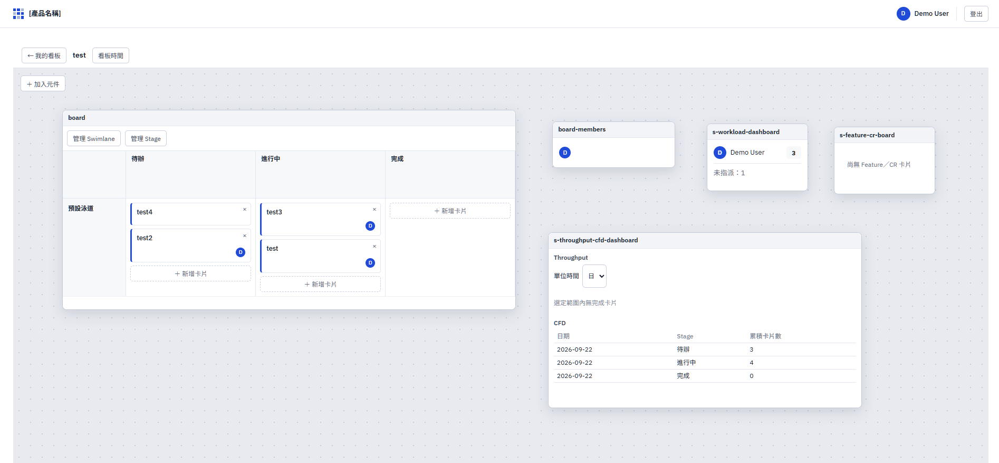

# Kanban

一個看板應用：Board（Swimlane × Stage）＋ 一個可自由擺放元件的畫布（Canvas），畫布上可以放看板本體、成員清單、工作量／Cycle-Lead-Time／WIP／Throughput-CFD／截止日期提醒等儀表板、Feature/CR 追蹤表、活動紀錄。



## 技術棧

- 後端：Java 25 / Spring Boot 4.1.1 / Lombok / Spring Data JPA / PostgreSQL
  - `kanban-core`：純領域模型（`io.progden.kanban.core.domain`），不依賴 Spring／JPA
  - `kanban-spring`：application／web／persistence 層，以及跨 aggregate 的讀取投影（`io.progden.kanban.query.*`）
- 前端：`kanban-frontend`（React 19 / TypeScript / Vite）

## 環境需求

- **JDK 25**：`kanban-core`／`kanban-spring` 的 Gradle toolchain 設定死 `JavaLanguageVersion.of(25)`（見兩個模組的 `build.gradle.kts`）。本機沒有的話，`./gradlew` 會嘗試自動下載，需要能連外網；用 [SDKMAN!](https://sdkman.io/) 手動裝一份也可以（`sdk install java 25-tem`）。
- **Node.js 20+**、**pnpm**：`kanban-frontend` 用 pnpm 管理依賴（`pnpm-lock.yaml`），**不要用 `npm install`**——lockfile 不是 npm 的格式，跑下去會把 `node_modules` 裝壞。沒有 pnpm 的話先 `npm i -g pnpm` 或 `corepack enable`。
- **PostgreSQL 16**：資料庫名稱 `kanban`，帳密預設都是 `kanban`（可用環境變數 `DB_HOST`／`DB_PORT`／`DB_NAME`／`DB_USERNAME`／`DB_PASSWORD` 覆寫，見 `kanban-spring/src/main/resources/application.yml`）。沒有現成的 PostgreSQL 可以用 Docker 起一個（見下方指令）；純跑 `kanban-core`／`kanban-spring` 的單元測試不需要（`kanban-spring` 測試用內嵌 H2）。
- **Docker**（選用，但最簡單）：沒有 Docker 的話要自己在本機裝 PostgreSQL 16，資料庫／帳密設定同上。
- **執行 e2e（`kanban-frontend/e2e/`）額外需要**：`pnpm exec playwright install chromium`（第一次跑之前下載瀏覽器），且後端／PostgreSQL 都要先啟動（`playwright.config.ts` 只會幫忙啟動前端 dev server）。

## 快速開始

```bash
# 1. 啟動 PostgreSQL（沒有現成的就用 Docker 起一個）
docker run -d --name kanban-postgres \
  -e POSTGRES_DB=kanban -e POSTGRES_USER=kanban -e POSTGRES_PASSWORD=kanban \
  -p 5432:5432 postgres:16-alpine

# 2. 啟動後端（localhost:8080）
./gradlew :kanban-spring:bootRun

# 3. 啟動前端（localhost:5173，經 Vite proxy 轉發 /api 到後端）
cd kanban-frontend
pnpm install
pnpm dev
```

前端更完整的開發指令（build／test／e2e）見 [`kanban-frontend/README.md`](kanban-frontend/README.md)。

## 專案結構

- `.dev/`：規格與設計文件，是行為的唯一依據，細節見下一節與 [`CLAUDE.md`](CLAUDE.md)
- `kanban-core`、`kanban-spring`：後端兩個模組
- `kanban-frontend`：前端
- `scripts/`：規格檢查腳本（`spec-check`／`ui-check`／`cr-check`），見 [`scripts/README.md`](scripts/README.md)

## `.dev/` 資料夾

專案的規格與流程文件都放在這裡，改程式碼前應該先讀對應文件，行為以這裡寫的為準，不是憑印象或看程式碼推測。

- `.dev/F<兩位數>-<名稱>/`：一個功能模組一個目錄（見下方 F01～F07 表），每個目錄底下固定放：
  - `spec-<模組>.md`：BDD 規格（Gherkin + usecase 區塊），行為的唯一依據
  - `ui-<模組>.md`：UI 短規格（畫面、資料表、操作表、角色、驗收條件）
  - `design-<模組>.md`（部分模組才有）：後端領域模型設計備忘
  - `legacy-spec-<模組>.md`：遷移前的規格備份，不會被腳本掃描
- `.dev/CR.md`：Change Request 總表，規格定稿後要改 Scenario／名詞表／角色表都要先在這裡開一筆 CR
- `.dev/conventions/`：撰寫規範（spec／ui／CR 怎麼寫、`spec-check`／`ui-check` 檢查清單對應的規則）
- `.dev/ui-prototype/`：各畫面的 HTML 靜態原型（`*.dc.html`），跑版或版面問題應該先跟這裡的截圖比對
- `.dev/loops/`：無人值守開發／遷移流程用的 loop（例如 `implementation-loop`）的規則書與執行期檔案
- `.dev/lesson-learned/`：開發過程中踩過的坑與對應規則，格式是「現象 → 根因 → 規則」
- `.dev/prompts/`、`.dev/improve/`：loop 用的提示詞與改善方案文件

## 功能模組（F01～F07）

| 編號 | 模組 | 重點 |
|---|---|---|
| F01 | basic-kanban | Board（含 Swimlane、Stage）與 Card |
| F02 | user-membership | 使用者、BoardMembership、卡片負責人多選、活動紀錄 |
| F03 | kanban-widgets | Cycle/Lead Time、WIP、Throughput/CFD、截止日期提醒 |
| F04 | board-clock | 每個 Board 自己的時鐘 |
| F05 | workload | 依負責人統計工作量 |
| F06 | feature-cr-board | 用看板追蹤 Feature／CR 卡的開發狀態 |
| F07 | canvas-layout | 每個 Board 一個可自由擺放元件的畫布 |
